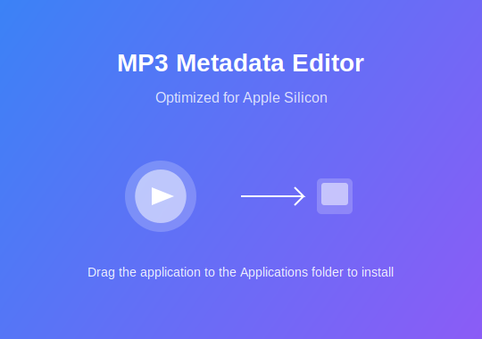

# MP3 Metadata Editor

A modern, sleek MP3 metadata editor optimized for Apple Silicon (M1/M2) processors.



## Features

- **Native M1/M2 Support**: Built specifically for Apple Silicon architecture
- **Modern UI**: Clean, intuitive interface using Tailwind CSS and Shadcn UI components
- **Fast Performance**: Optimized for Apple Silicon's ARM64 architecture
- **Efficient Power Usage**: Designed with power management in mind for longer battery life
- **Beautiful Interface**: Card-based design with proper spacing and visual hierarchy
- **Native macOS Integration**: Uses native vibrancy effects and dark mode support

## Installation

Download the DMG file from the `out/make` directory, open it, and drag the MP3 Metadata Editor to your Applications folder.

## Development

### Prerequisites

- Node.js 16+
- npm or yarn
- Electron

### Setting up the development environment

1. Clone the repository
   ```bash
   git clone <repository-url>
   cd mp3info
   ```

2. Install dependencies
   ```bash
   npm install
   ```

3. Start the development server
   ```bash
   npm run dev
   ```

### Building for Apple Silicon (M1/M2)

To build an optimized package for Apple Silicon:

```bash
./build-m1.sh
```

This will create a DMG file in the `out/make` directory optimized for M1/M2 Macs.

## Tech Stack

- **UI Framework**: React 18 with TypeScript
- **Styling**: Tailwind CSS
- **Components**: Shadcn UI
- **Icons**: Lucide React
- **Desktop Framework**: Electron
- **MP3 Metadata**: node-id3

## License

ISC 